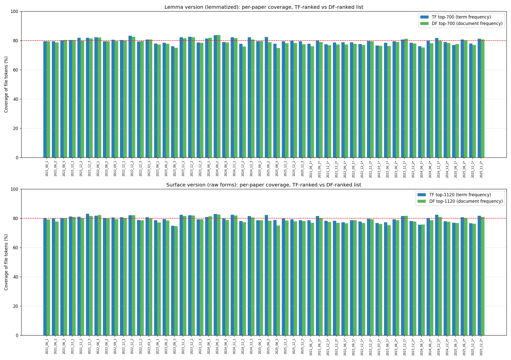

# [CET4]2026英语四级高频词汇免费（近五年）可打印PDF1250词，大学生核心

从近五年（2021–2025）大学英语四级（CET-4）**真题**中统计高频词汇，并排版成可背诵的词表。
本项目复现并改进了 [liut969/CET](https://github.com/liut969/CET) 的思路。

## 前言

市面上的"四级高频词"良莠不齐，无从判断是否真高频、背了是否有用。
liut969 的方法很可信：直接统计历年真题里每个词的出现频次，按频率排序
本项目用**更新的 2021–2025 真题**重做一遍，并在方法上做了三点改进：

1. **词形还原**：把 `studies / studied / studying` 合并计入 `study`（liut969 是按词形原样计数）。
   两种口径都产出，见 `output/`。
2. **文档频率（DF）**：除了累计词频（TF），还统计"一个词出现在多少套卷子里（DF）"，
   衡量跨卷稳定性。
3. **真实例句**：每个词的例句直接从真题语料中抽取（残缺片段则由 deepseek-v4-pro(截止2026/5/20，下文不再重复此描述) 用四级词汇改写并标注）。

如果能帮助到大家最好不过。
理论来说应该可以简单的复刻CET6和考研英语。
如果有人制作了CET6和考研英语版本或者国内下载链可以联系我放上来。

## 结论

| TF版本指标      | 词形还原版       | 词形原样版        |
| ----------- | ----------- | ------------ |
| 总词数（unique） | 6,837       | 9,398        |
| 总 token     | 145,621     | 144,749      |
| 80% 累计覆盖截点  | top-**701** | top-**1124** |

- **逐卷覆盖率**：全局 80% 高频表在每一份单卷中同样覆盖约 **80%** 的词次
  （`coverage_chart.png`）——证明高频词是真高频，方法成立。
- **TF vs DF**：两种口径产出的榜单 top-N 重叠约 **88%**，逐卷覆盖率仅差 0.8 个百分点
  （`coverage_tf_vs_df.png`）——榜单对计数方式稳健。
- **与 liut969 对比**：词形原样版 top-1250 与其 2018–2023 词表重叠 **76.8%**；
  差异主要来自话题更替，正是用新数据重做的意义。

| 文件 | 内容 |
|------|------|
| `英语四级TF词频top-1250.pdf` / `…DF词频…` | **成品 PDF** · liut969 同款双栏排版，含词频 |
| `英语四级TF-top-1250.pdf` / `…DF-…` | **成品 PDF** · 不含词频 |
| `英语四级TF自编例句标注top-1250.pdf` / `…DF…` | **成品 PDF** · 含词频，并标注自编例句 |

---

> 有意思的是，DF 和 TF 几乎一样：


|对比项|词形还原版|词形原样版|
|---|---|---|
|DF 榜 vs TF 榜 top-N 重叠|87.9%|88.6%|
|逐卷覆盖率（TF 榜）|79.7%|79.7%|
|逐卷覆盖率（DF 榜）|78.9%|78.9%|

- 改成"每卷只算一次"对高频榜单**几乎没影响**——两种榜单 ~88% 相同，覆盖率只差 0.8 个百分点。这其实是**稳健性验证**：真高频词既"出现次数多"又"每套卷都出现"，两个指标自然一致。
- DF 榜覆盖率略低（-0.8pp）符合预期：TF 排序天然就是为"覆盖最多 token"优化的；DF 排序优化的是"分布广度"，会让个别"每卷都出现但单卷次数不多"的词挤掉高 TF 词。
- 真正的差异只在**中长尾**——比如某篇阅读反复出现的话题词（高 TF、低 DF）会在 DF 榜里降级。



## `output/`说明（）

| 文件 | 内容 |
|------|------|
| `high_freq_surface.csv` | 词频表 · 词形原样版（liut969 口径，9393 词） |
| `high_freq_lemma.csv` | 词频表 · 词形还原版（6835 词） |
| `high_freq_surface_df.csv` / `high_freq_lemma_df.csv` | 文档频率（DF）表 |
| `high_freq_cet4_v2.txt` | **主词表**：前 1250 词，含音标 / 释义 / 变形 / 例句 |
| `high_freq_cet4_v2b.txt` | 同上，但 960 个与 liut969 重合的词复用其词典数据 |
| `high_freq_cet4_v2b_marked.txt` | v2b + `★` 标注本表独有的 290 个新高频词 |
| `high_freq_cet4_df.txt` | 按文档频率排序的背诵表 |
| `high_freq_cet4_v1.txt` | 早期版本（提示词迭代留存，仅作对比） |
| `英语四级TF词频top-1250.pdf` / `…DF词频…` | **成品 PDF** · liut969 同款双栏排版，含词频 |
| `英语四级TF-top-1250.pdf` / `…DF-…` | **成品 PDF** · 不含词频 |
| `英语四级TF自编例句标注top-1250.pdf` / `…DF…` | **成品 PDF** · 含词频，并标注自编例句 |
| `coverage_chart.png` · `coverage_tf_vs_df.png` | 方法验证图表 |

> 共 6 份 PDF：TF（词频版）/ DF（文档频率版）各 3 种样式。

## 方法 / 流水线

```
真题 PDF ──┬─ 可提取文本 ─→ extract_text_pdfs.py ─┐
           └─ 扫描图像 ───→ batch_ocr.py (Qwen) ──┴─→ corpus/  纯英文语料
                                                          │
            corpus/ ─→ build_frequency.py     ─→ 词频表(TF)  │
                    ─→ build_doc_frequency.py ─→ 文档频率(DF) │
                    ─→ extract_examples.py    ─→ 真题例句     │
                                                          ▼
   examples_30_template.txt(手写范例) ─→ deepseek_format.py (DeepSeek 排版)
                                                          │
                              ─→ assemble_final.py / build_v2b.py / build_df_table.py
                                                          ▼
                                                      output/ 词表
```

- **OCR**：多数真题 PDF 是扫描图，用阿里 **Qwen** 视觉模型 `qwen3-vl-plus` 整份识别
- **统计**：spaCy 分词 + 词形还原；保留功能词（不过滤停用词，与 liut969 一致）。
- **排版**：用 **DeepSeek** `deepseek-v4-pro` 为每个词补音标 / 释义 / 变形、翻译例句；
  固定系统提示词命中缓存以降低成本。

## 目录结构

```
.
├── README.md / requirements.txt / .gitignore
├── api-sk.example.json      复制为 api-sk.json 并填入密钥
├── scripts/                 全部流水线脚本 + 手写范例模板
├── cet4_2021 … cet4_2025/   源数据：四级真题 PDF（及听力 MP3）
├── CET-main/                liut969 的参考词表 PDF
├── corpus/                  提取出的纯英文语料（papers/ + listening/）
├── intermediate/            流水线中间产物（已保留，复现时可跳过付费 API 步骤）
└── output/                  最终成品
```

## 复现步骤

特别提示：需要按照api-sk.example.json编写api-sk.json

```bash
# 1. 环境
python -m venv .venv && source .venv/bin/activate
pip install -r requirements.txt
python -m spacy download en_core_web_sm

# 2. 密钥（OCR 与排版需要）
cp api-sk.example.json api-sk.json   # 然后填入 qwen / deepseek 的 API key

# 3. 运行流水线（脚本均从仓库根目录调用）
python scripts/extract_text_pdfs.py    # 提取可直接读取文本的 PDF
python scripts/batch_ocr.py            # OCR 扫描版 PDF        [需 qwen key]
python scripts/audit_corpus.py         # （可选）核对语料完整性
python scripts/build_frequency.py      # 词频表 TF
python scripts/build_doc_frequency.py  # 文档频率表 DF
python scripts/extract_examples.py     # 从语料抽取例句
python scripts/parse_liut969.py        # 解析 liut969 参考词典
python scripts/deepseek_format.py      # LLM 排版词条      [需 deepseek key]
python scripts/assemble_final.py       # 汇总主词表 v2-A
python scripts/build_v2b.py            # 生成 v2-B
python scripts/build_df_table.py       # 生成 DF 排序表    [需 deepseek key]
python scripts/per_paper_coverage.py   # 验证图表
python scripts/coverage_compare.py     # TF vs DF 对比图

# 4. 排版成 PDF（liut969 同款双栏样式，TF/DF 各三种样式，共 6 份）
TF=output/high_freq_cet4_v2.txt;  DF=output/high_freq_cet4_df.txt
python scripts/make_pdf.py $TF "output/英语四级TF词频top-1250.pdf" "英语四级真题高频词汇" "TF 词频版 · top 1250"
python scripts/make_pdf.py $DF "output/英语四级DF词频top-1250.pdf" "英语四级真题高频词汇" "DF 文档频率版 · top 1250"
python scripts/make_pdf.py $TF "output/英语四级TF-top-1250.pdf" "英语四级真题高频词汇" "TF 版 · top 1250" --no-freq
python scripts/make_pdf.py $DF "output/英语四级DF-top-1250.pdf" "英语四级真题高频词汇" "DF 版 · top 1250" --no-freq
python scripts/make_pdf.py $TF "output/英语四级TF自编例句标注top-1250.pdf" "英语四级真题高频词汇" "TF · 标注自编例句" --mark-selfmade
python scripts/make_pdf.py $DF "output/英语四级DF自编例句标注top-1250.pdf" "英语四级真题高频词汇" "DF · 标注自编例句" --mark-selfmade
```

> `make_pdf.py` 开关：`--no-freq` 不输出词频行，`--mark-selfmade` 标注自编例句。

> `make_pdf.py` 用系统字体 `/Library/Fonts/Arial Unicode.ttf`（macOS）；
> 其他平台请改 `scripts/make_pdf.py` 里的 `FONT_PATH` 为本机一个含中文与音标的字体。

仓库已包含 `corpus/`、`intermediate/`、`output/`，所以**只想看结果或重做统计**的话，
无需 API key，跳过第 2 步和 OCR / DeepSeek 相关步骤即可。所有耗费 API 的脚本都支持
断点续传（已存在的结果文件会跳过）。


## 致谢

- 方法与参考词表：[liut969/CET](https://github.com/liut969/CET)
- OCR：阿里云百炼 Qwen 视觉模型；词条排版：DeepSeek

> 真题 PDF 等源数据版权归命题方所有，仅供学习研究使用。